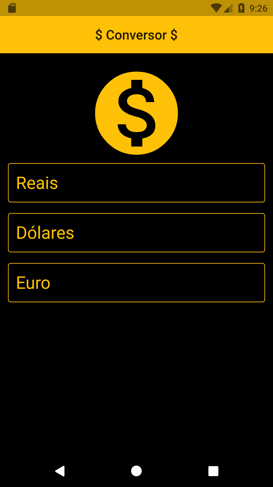
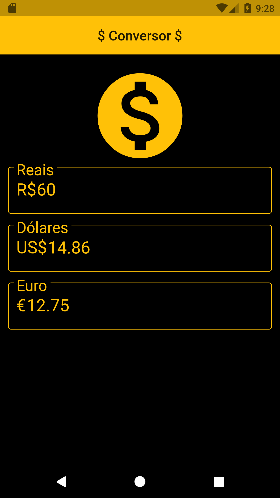

# Conversor de Moedas

## Flutter

### Essa aplicação vai ajudar você para fazer alguns calculos rapidos quando estiver precisando verificar o valor do Real, Dolar e Euro.

## Modo de Execução

- Você vai precisar do JDK, e da library do Flutter instalado.
- Esse App ainda esta em desenvolvimento.
- Então logo ele vai esta em produção para uso no PlayStore.
